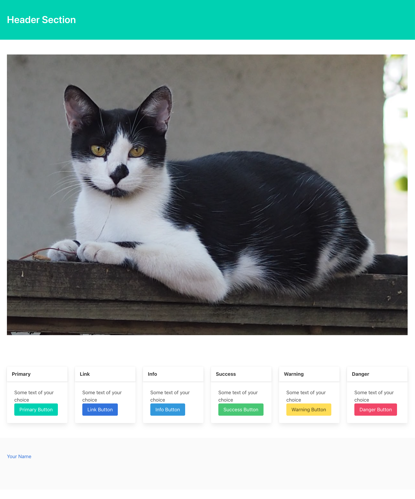

# Assignment: HTML and CSS

You will find here a file `index.html`. 
In it, design a web page with the following characteristics:
- it should have a <head/> and a <body/> (0.5 point)
- it should use the Bulma css library (0.5 point)
- it should contain a <header/> a <footer/> and two <section/>s in between. (one point)
- One section with class "top" and one with class "bottom". (1 point)
- The top section should contain an  that fills the page horizontally and show the image of a cat. The image is provided in this repository. (1 point)
- the bottom section should contain 6 columns (1 point)
- each column should contain a card (1 point)
- each card should have a header and content (1 point)
- each card content the cards be some text of your choice followed by a button. In total there should 6 buttons, one per column, one of each of the Bulma styles "primary", "link", "info", "success", "warning", "danger". (1 point)
- each card header should have title with the name of the style of the corrensponding button. (1 point)
- the footer should contain an a link that, on click, will open the user's default email app with To: file equal to your email address. The text of the link should be your name. (1 point)

Within these requirements you can be creative.
Commit your code and push it to your class-assigned github repo.

## Grading

You can grade the assignment yourself, like this: 

    python grade.py

## Submission

To submit, first crete the zip file, via: 

    python zipit.py

This creates the file `submission.zip`.  Submit this file to this [Google form](https://docs.google.com/forms/d/e/1FAIpQLSc592lfBot2-F-IHW6qM7tR0X15MdB6_9oC4zRMPY6WlIwvNA/viewform?usp=sf_link), and **be sure to press SUBMIT on the form**.  Just uploading the file to the form is not enough. 

## Sample solution

Here is a screenshot of a possible solution:

